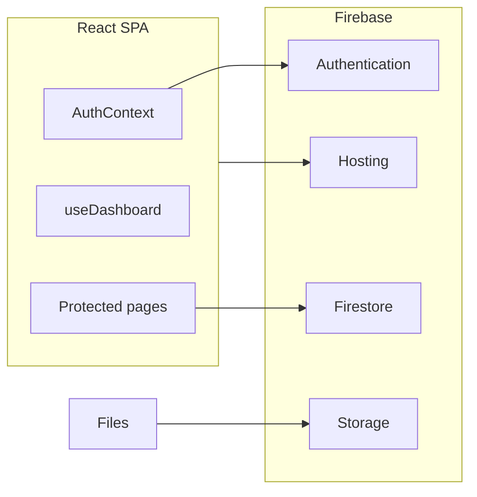

# AP Track — Client Productivity Platform

Production-ready personal productivity web application. Tracks tasks, goals, skills (with improvement trends), spending, notes, calendar, files, and activity — with real-time Firebase sync and analytics dashboards.

## Stack

- React 19 + Vite 8
- Tailwind CSS 4
- **Firebase** (Auth, Firestore, Storage, Hosting)
- Recharts (analytics)
- Framer Motion

There is no separate Node backend: Firebase is your backend (auth + database + file storage).

## Architecture



| Layer | Role |
|-------|------|
| **Frontend** | Vite React app in `src/` |
| **Auth** | Email/password + Google (`src/context/AuthContext.jsx`, `src/lib/auth.js`) |
| **Database** | Firestore per-user paths: `users/{uid}/...` |
| **Files** | Storage at `users/{uid}/...` |
| **Security** | `firestore.rules` + `storage.rules` (owner-only access) |

## Client setup

### 1. Install

```bash
npm install
```

### 2. Firebase project

1. Create a project at [Firebase Console](https://console.firebase.google.com)
2. Enable **Authentication**: Email/Password + Google
3. Create **Firestore** (production mode)
4. Enable **Storage**
5. Register a **Web app** and copy config into `.env`:

```bash
cp .env.example .env
```

Fill in all `VITE_FIREBASE_*` values from Project Settings → Your apps.

### 3. Firebase CLI (deploy)

```bash
npm install -g firebase-tools
firebase login
cp .firebaserc.example .firebaserc
```

Edit `.firebaserc` and set your project id.

Deploy security rules first:

```bash
npm run deploy:rules
```

### 4. Run locally

```bash
npm run dev
```

Production build:

```bash
npm run build
npm run preview
```

## Deploy everything to Firebase

```bash
npm run deploy
```

This builds the app and deploys:

- **Hosting** → `dist/` (frontend)
- **Firestore rules** → database security
- **Storage rules** → file security

Deploy only hosting after code changes:

```bash
npm run deploy:hosting
```

## Auth & dashboard framework

| Piece | Location |
|-------|----------|
| Validation & safe error messages | `src/lib/auth.js` |
| Auth state & sign-in/out | `src/context/AuthContext.jsx` |
| Guest routes (login/signup) | `src/components/auth/GuestRoute.jsx` |
| Protected app routes | `src/components/auth/ProtectedRoute.jsx` |
| Firebase config gate | `src/components/auth/FirebaseConfigGate.jsx` |
| Dashboard data hook | `src/hooks/useDashboard.js` |

## Features

| Module | Capabilities |
|--------|----------------|
| **Dashboard** | Skills trends, spending charts, task activity, goals, skill improving/declining badges |
| **Tasks** | CRUD, drag-and-drop, status, due dates, tags |
| **Goals** | Progress tracking with charts |
| **Skills** | Level tracking, +5 quick update, trend badges, history graphs |
| **Finance** | Expense logging, category breakdown, spending over time |
| **Notes** | Rich text, auto-save, pin, search |
| **Calendar** | Reminders, deadlines |
| **Files** | Upload/download via Storage |
| **Activity** | Work history, streaks |
| **Settings** | Profile name, dark/light theme |

## First login

New users receive sample tasks, goals, skills, expenses, and chart history automatically.

## Project structure

```
src/
├── components/auth/   # ProtectedRoute, GuestRoute, config gate
├── context/           # Auth & theme providers
├── firebase/          # Firebase init
├── hooks/             # useAuth, useDashboard, useCollection
├── lib/               # auth helpers, metrics, seed
└── pages/             # Routes
```

## License

Proprietary — for client use.
